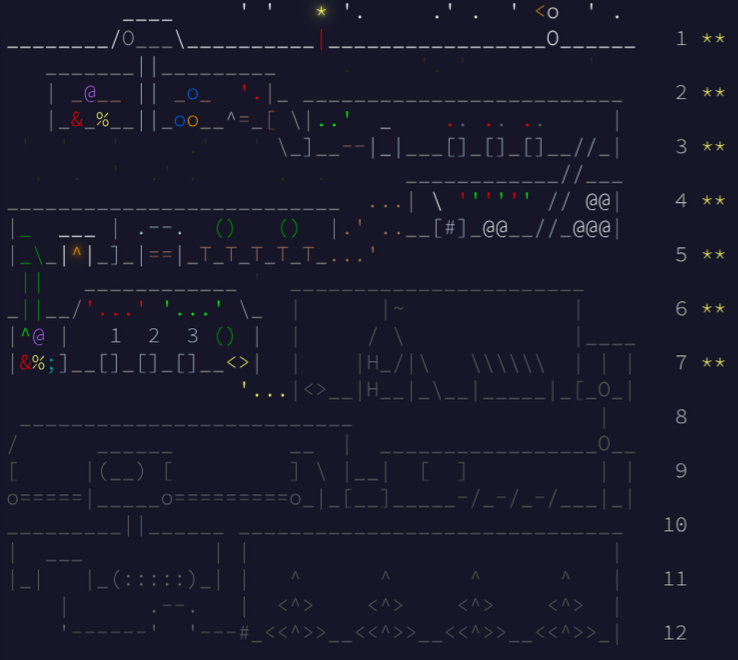

# Advent of Code 2025

This repository contains my solutions for **Advent of Code 2025**  
👉 [https://adventofcode.com/2025](https://adventofcode.com/2025)

Each day includes a new programming puzzle, and I solve them here using TypeScript.

## Challenges

- [Day 1: Secret Entrance](https://adventofcode.com/2025/day/1)
- [Day 2: Giftshop](https://adventofcode.com/2025/day/2)
- [Day 3: Lobby](https://adventofcode.com/2025/day/3)
- [Day 4: Printing Department](https://adventofcode.com/2025/day/4)
- [Day 5: Cafeteria](https://adventofcode.com/2025/day/5)
- [Day 6: Trash Compactor](https://adventofcode.com/2025/day/6)
- [Day 7: Laboratories](https://adventofcode.com/2025/day/7)
- [Not solved - Day 8: Playground](https://adventofcode.com/2025/day/8)
- [Not solved - Day 9: Movie Theaterc](https://adventofcode.com/2025/day/9)
- [Not solved - Day 10: Factory](https://adventofcode.com/2025/day/10)
- [Not solved - Day 11: Reactor](https://adventofcode.com/2025/day/11)
- [Not solved - Day 12: Christmas Tree Farm](https://adventofcode.com/2025/day/12)

## Progress



## Structure

```
├── src/
│   ├── day1-secret-entrance/    # Day 1 solution
│   │   ├── index.ts             # Solution code
│   │   └── resources/
│   │       └── input.txt        # Puzzle input
│   ├── dayX**/                  # Day X solution
│   └── utils/                   # Shared utilities
│       └── InputReader.ts       # Generic input file reader
├── package.json
└── tsconfig.json
```

## How to Use

### Setup
```bash
npm install
```

### Run Solutions
```bash
# Run Day 1
npm run day1

# Run all
npm run all

# Build all solutions
npm run build

# Watch mode for development
npm run build:watch
```
